# Puzzle & Monsters システム図解

このドキュメントは、Puzzle & Monsters ゲームの各種システムを図で可視化しています。

## 目次

- [Puzzle \& Monsters システム図解](#puzzle--monsters-システム図解)
    - [目次](#目次)
    - [クラス構成図](#クラス構成図)
    - [クラス依存関係図](#クラス依存関係図)
    - [バトルフロー図](#バトルフロー図)
    - [ジェムマッチプロセス](#ジェムマッチプロセス)
    - [ダメージ計算フロー](#ダメージ計算フロー)
    - [ゲーム初期化シーケンス](#ゲーム初期化シーケンス)
    - [単一ターン処理シーケンス](#単一ターン処理シーケンス)
    - [属性相性図](#属性相性図)
    - [相性倍率マトリックス図](#相性倍率マトリックス図)
    - [パーティHP管理](#パーティhp管理)
    - [コンボシステム](#コンボシステム)

---

## クラス構成図

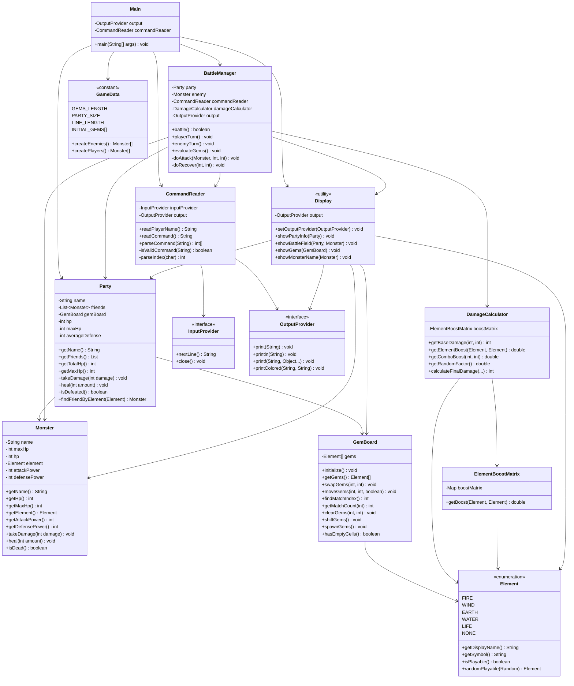

---

## クラス依存関係図

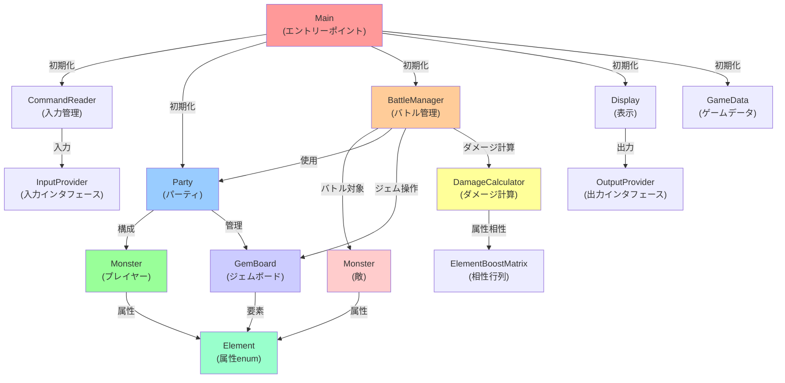

---

## バトルフロー図

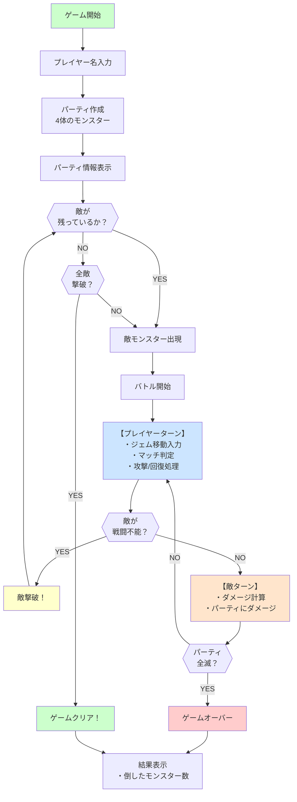

---

## ジェムマッチプロセス

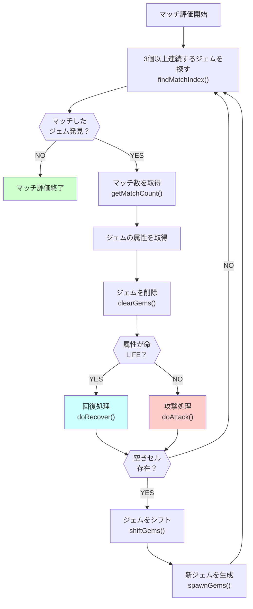

---

## ダメージ計算フロー

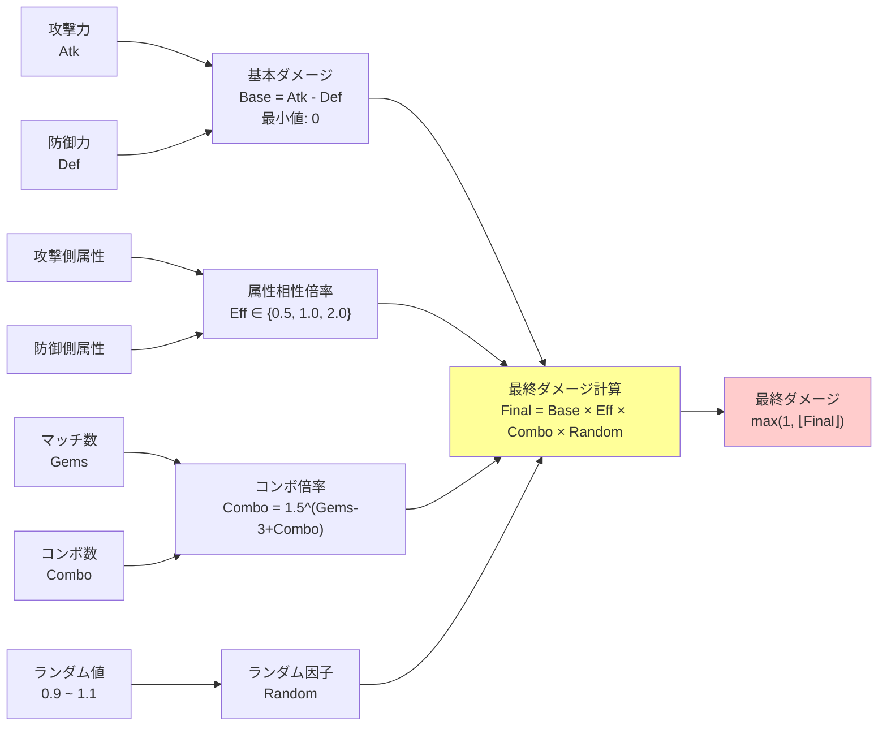

---

## ゲーム初期化シーケンス

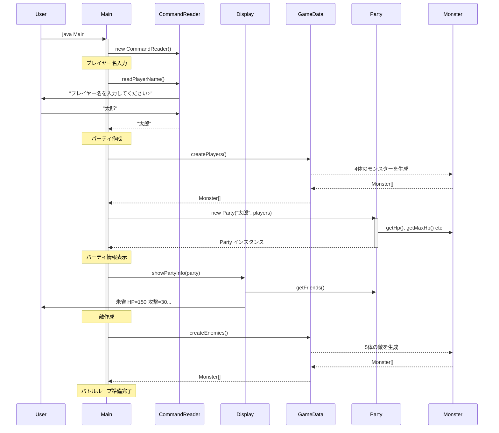

---

## 単一ターン処理シーケンス

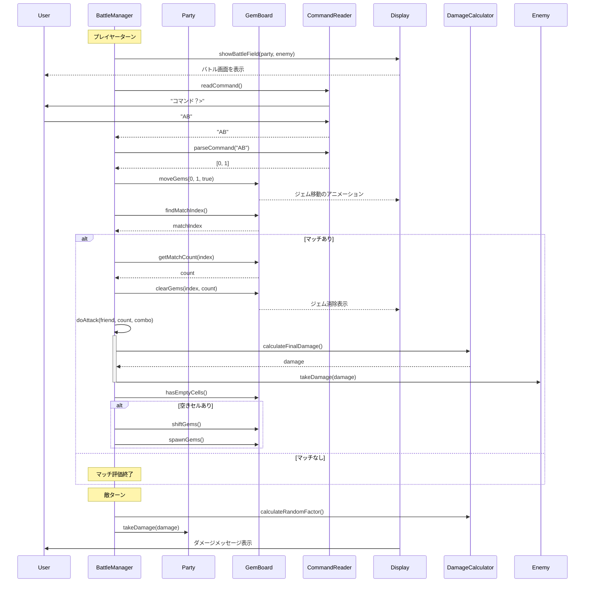

---

## 属性相性図

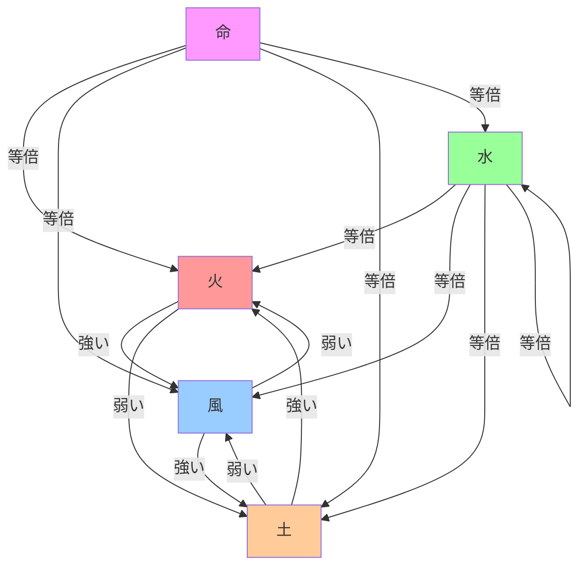

---

## 相性倍率マトリックス図

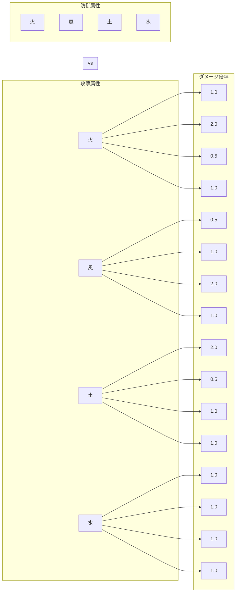

---

## パーティHP管理

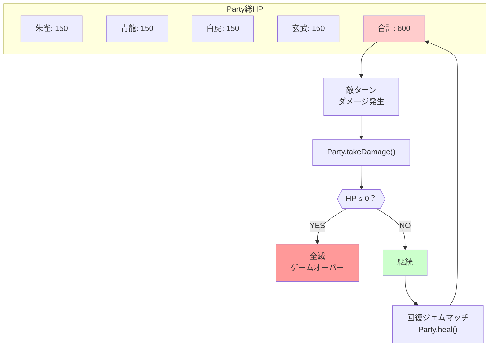

---

## コンボシステム

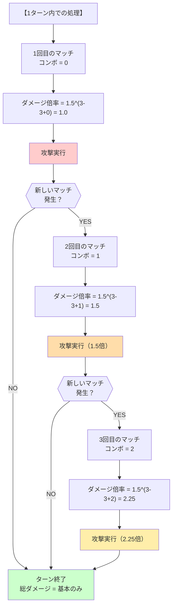
